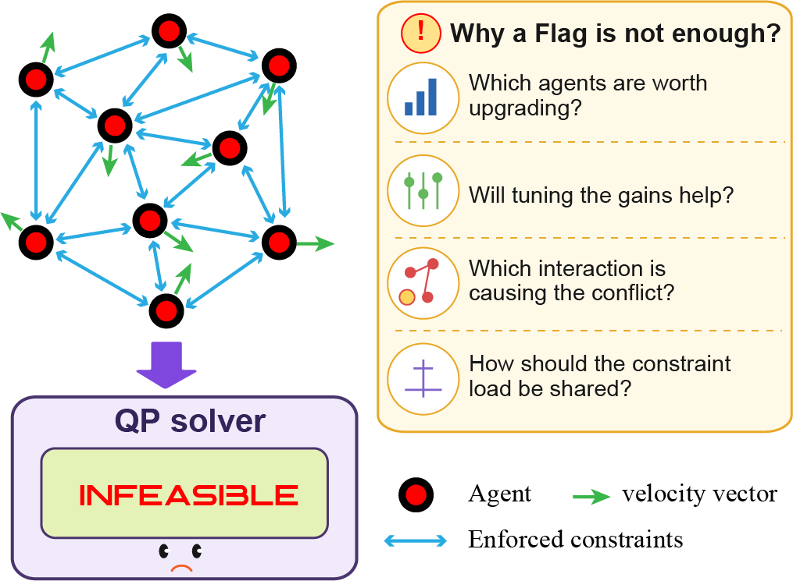

<div align='center'>
<h2 align="center"> When the Safety Filter Fails: Exact Diagnosis of Infeasibility in Multirobot Control Barrier Functions</h2>

**Stop guessing why the QP said no.**

<a href="mailto:chandanks@iisc.ac.in">Chandan Kumar Sah</a>,
<a href="mailto:kjishnu@iisc.ac.in">Jishnu Keshavan</a>

<h3 align="center"> DACAS Lab, Indian Institute of Science, Bangalore</h3>

[](...)
[](...)
[](https://USER.github.io/REPO/demo.html)
[](LICENSE)
 <div align="center"></div>

<p align="center">
  <video src="https://github.com/USER/REPO/raw/main/assets/hero.gif" width="100%" autoplay loop muted playsinline></video>
  
</p>

<p align="center">
  <em>Sixteen underactuated robots. Every edge is a shared safety constraint,
  coloured by <b>who is responsible for it</b>. One linear program chooses the
  division at every control step, and no local program is ever infeasible.</em>
</p>
</div>

## 📃 Abstract

Pointwise infeasibility of multirobot control barrier function safety filters offers little guidance on its cause. We derive an **exact conic certificate** whose sign decides feasibility and whose value separates the problem into a *demand* term, set by the barrier encoding, and a *supply* term, set by the geometry of the input sets. The supply is invariant to the class K functions, so retuning gains cannot create capability. Structurally degenerate states exist at which no increase in actuation restores feasibility. The multiplier is sparse, naming the few interactions and agents responsible. Because the certificate prices any division of a shared constraint exactly, the optimal division solves a **single linear program**, computed centrally and executed locally. Across 320 paired closed loop runs it reduces infeasible steps from about 50% to **6.0%**, matching a centralized filter, and cuts runs containing a safety violation from 118 of 160 to **23 of 160**, at 2.3 ms per step.

## News :newspaper:
* **September 2026**: Paper submitted to ICRA 2027.
* **September 2026**: Code and interactive demo released.

<!-- TABLE OF CONTENTS -->
<details open="open" style='padding: 10px; border-radius:5px 30px 30px 5px; border-style: solid; border-width: 1px;'>
  <summary>Table of Contents</summary>
  <ol>
    <li><a href="#motivation">Motivation</a></li>
    <li><a href="#key-contributions">Key contributions</a></li>
    <li><a href="#installation">Installation</a></li>
    <li><a href="#repository-structure">Repository structure</a></li>
    <li><a href="#citation">Citation</a></li>
  </ol>
</details>

## Motivation

A multirobot safety filter enforces one barrier constraint per pair of robots, and every robot has bounded actuation. When enough of those constraints compete for the same limited thrust, the quadratic program has no solution and the solver returns a single word:

```
QP status: INFEASIBLE
```

That is the entire diagnostic. It does not say which of the many enforced interactions caused the conflict, which robot would benefit from a stronger actuator, whether retuning the class K gains would have helped at all, or how the shared load should have been divided in the first place. The designer is left to guess, and the usual guesses are expensive: add actuation, retune gains, or drop constraints.

<p align="center">
  
</p>

We show that a single conic program answers all four questions at once. Its optimal value `M(x)` decides feasibility exactly, and its optimal multiplier is sparse enough to point at the culprit.

## Key contributions

1. An **exact feasibility certificate** whose sign decides whether any admissible input satisfies every constraint, and whose value splits into a *demand* term and a *supply* term.
2. **Encoding invariance**: the supply is independent of every class K function, so retuning gains cannot create capability. Exactly one narrow exception exists.
3. **Structural degeneracy**: states at which the constraint normals annihilate every robot's thrust axis, so scaling actuation by any factor leaves the certificate unchanged.
4. **Sparse attribution**: the multiplier names a handful of interactions and robots regardless of fleet size, and is right 94% of the time.
5. **Certificate optimal allocation**: the best division of every shared constraint is a **single linear program**, solved centrally and executed locally.

## Installation

```bash
git clone https://github.com/USER/REPO.git
cd REPO
pip install -e ".[figures]"          # add [dev] as well if you want to run the tests
# ffmpeg is needed only for the scripts in media/
```

Python 3.9 or newer. Linear programs go to `scipy.optimize.linprog`; the safety filters go to CLARABEL through cvxpy. Installing in editable mode puts `mrcbf` on the path, so the scripts under `experiments/`, `figures/` and `media/` run from anywhere.

Run the tests with:

```bash
pytest -q
```

## Repository structure

```text
.
├── .github/                              # continuous integration
│   └── workflows/
│       └── tests.yml
├── assets/                               # figures and videos used in this README
│   ├── allocation.mp4
│   ├── fig10_allocmech_comb.png
│   ├── fig8_attribution_illust2.png
│   ├── fig9_allocation_illust.png
│   ├── fig_motivation.png
│   ├── hero.gif
│   └── hero.mp4
├── data/                                 # the 1280 runs behind the results table
│   ├── results_heterogeneous.jsonl
│   └── results_homogeneous.jsonl
├── docs/                                 # served by GitHub Pages
│   └── demo.html                         # interactive demo, no dependencies
├── experiments/                          # scripts to reproduce the paper
│   ├── run_allocation.py                 # the closed loop comparison
│   ├── summarise.py                      # raw runs into the results table
│   └── validate_certificate.py           # certificate against an independent solver
├── figures/                              # figure generation
│   ├── fig_allocation.py
│   ├── fig_attribution.py
│   ├── fig_mechanism.py
│   ├── fig_timelapse.py
│   └── style.py                          # shared publication style
├── media/                                # videos for the project page
│   ├── make_comparison_video.py
│   └── make_hero.py
├── src/                                  # the installable package
│   └── mrcbf/                            # the library, about 500 lines
│       ├── __init__.py                   # public API
│       ├── certificate.py                # the reserve M(x), its multiplier, the three allocations
│       ├── filters.py                    # local and joint safety filters, closed loop rollout
│       └── model.py                      # agent dynamics and the barrier chain
├── tests/                                # pytest suite, run on every push
│   ├── test_allocation.py                # includes the never worse than uniform guarantee
│   └── test_certificate.py               # includes a check against an independent solver
├── .gitignore
├── CITATION.cff                          # GitHub renders a cite button from this
├── LICENSE
├── README.md
├── pyproject.toml                        # packaging, dependencies, pytest settings
└── requirements.txt                      # pinned alternative to the pyproject extras
```

All figure PDFs embed editable TrueType fonts (`pdf.fonttype = 42`) and open as **editable vector art** in Illustrator.

### A note on reproducibility

The filters are cvxpy problems compiled once and re-solved with new parameter values, which is where most of the speed comes from. A side effect is that the solver warm starts from the previous solution, so results depend very slightly on the order runs execute in. The effect is around a tenth of a percentage point in the pooled rates. Build a fresh `LocalFilter` per episode if you need bit identical runs and can afford the compile time.

## Citation

```bibtex
@inproceedings{sah2027certificate,
  title     = {When the Safety Filter Fails: Exact Diagnosis of Infeasibility
               in Multirobot Control Barrier Functions},
  author    = {Sah, Chandan Kumar and Keshavan, Jishnu},
  booktitle = {IEEE Int. Conf. on Robotics and Automation (ICRA)},
  year      = {2027}
}
```

## License

MIT — see [LICENSE](LICENSE).
